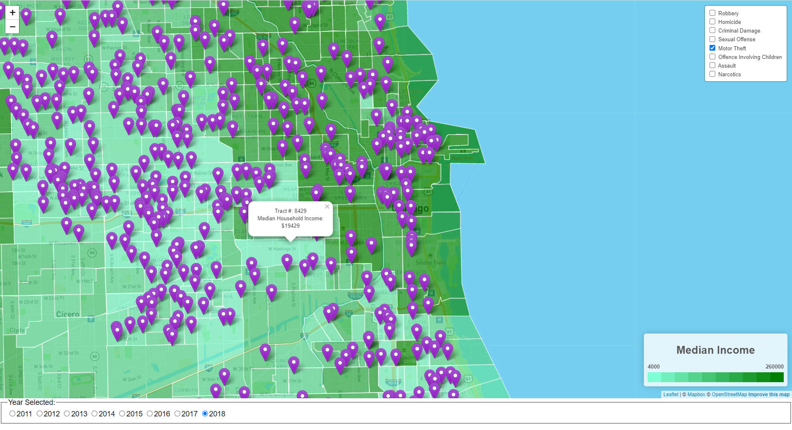

# Comparing Annual Median Income and Annual Crimes by Census Tract in Chicago

In this two week project, created a web-based application that allows users to visualize annual local median income information overlaid with Chicago area crime data for user selected crimes from 2011 to 2018.

The objective was to provide users information that allows one to analyze if there exists any correlation between regional crimes and median income. It was also the intent to allow users to visualize how crime rates and median income levels changed over various geographic regions from year to year.

## Data Wrangling

### Median Household Income

* Median Household Income and Geo Tracts Obtained and Defined Using R

* American Community Survey (ACS) Library – Provides U.S. Census data

* Used acs.fetch to download demographic data via the Census API and converted to an acs object

* Used this call to obtain median household income for each tract within the Chicago area

### Geo Tracts

* Researched multiple packages for collecting geo tract data and mapping the information – R proved to be the best environment

* The tigris package provides a uniform interface for R to download and work with line shapefiles from the United States Census Bureau

* Used tigris to pull shapefiles for Chicago for all tracts as defined within the U.S. Census data

* Merged Geo Tracts and Median Income on “GEOID”. Created one data frame w/geography for tracts and median income

### Merged Data

* Visualized the merged data in R with Leaflet

* Exported merged data to GeoJSON files to be used for populating the web site through Javascript

## Crime Data Downloaded Then Cleaned with Python in Jupyter Notebook Environment

* Researched sites to find crime data for the Chicago area

* Downloaded crime data from the Chicago Data Portal as CSV spanning 2001 to present – obtained more than 7 million lines

* Utilizing Python, narrowed data set to include a random sampling of 500,000 criminal events over the 20-year period

* Obtained a list of unique crimes

* Removed all crimes missing latitude and longitude coordinates

* Converted the year to numeric 

* In analyzing median income data, after noticing inconsistencies in data prior to 2011, restricted information to the period from 2011 to 2018

* Created connection to sqlite using the create_engine function and created sqlite table to enable use of data for the web application

* Once data cleaned and exported to sqlite, top 8 crimes were selected to be used in creating web application

## Web Site Development

### Flask SQLAlchemy

* Used SQLAlchemy to connect to the sqlite database 

* Using sql (select statement) queried the crimes data table to pull all the crime data

* Used python to convert query results to objects of key-value pairs and jsonified the return values writing them into a json file

* Created the json crime file in the local folder

### Created Default Map and Settings for Landing Page

* Used L.map to create base map location in Chicago and to set zoom level

* Added tile layer using mapbox and openstreetmap

* Defined base year as 2018 which was then used to pull the median income data from the appropriate GeoJSON file

* GeoJSON data was used to create a choropleth layer on the base map which populated each tract with colors representing median income grouping

* Using the assigned colors, created legend for median income data based on the base year of 2018

* Added control boxes to allow user to select crimes for the base year to be visualized on the map 

* Added interactivity in the form of pop up labels that on clicking a census tract show the number of the census tract along with its median income for 2018

### Created Radio Buttons for Year Selection

* Added radio buttons to the bottom of web page to allow user to select various years to be visualized

* Using d3.selectAll, tracked changes to radio button selection

* On change, updated median income map with census tract data for the selected year

* Selected year was set as a variable that would be used to retrieve crime data for that year when user chooses various crimes to be visualized

### Created Check Boxes for Crime Selection

* Added check boxes to the right-hand side of the web page to allow user to select various crimes to be visualized

* When a crime is selected, relevant latitude and longitude coordinates are pulled from sqlite database

* Pins are then added to the map for the location of all occurrences of the newly selected crime in the selected year

* Added interactivity with a pop up that shows the date, crime type, and location of each crime when a pin is clicked

## Final Web Page

## Next Steps

With More Time Would Like to Do the Following

* Replace the radio buttons that control the year shown with a slider that the user moves to select specific years

* When zoomed out, have the crimes shown with a heatmap that transitions to pins when the user zooms in on a specific area

* Find data sources to increase the years available for analysis

* If reducing years, take sampling of crimes after year reduction

* Allow for use of all available crimes (remove sampling)

* Refactor code to make it cleaner and less repetitive

* Change choropleth layer to reflect different socio-economic measures (i.e. percent below poverty level)

* Improve comparability of crimes between years by holding previously selected crimes fixed when a new year is chosen

